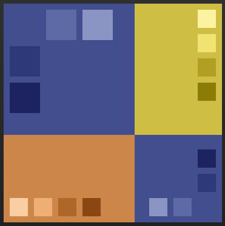

# UI  Guidelines
### Color Schemes
##### Primary
- `Primary : #39538D`
- `Primary-Dark : #243E79`
- `Primary-Light : #566EA4`
##### Secondary
- `Secondary : #D38647`
- `Secondary-Dark : #B56726`
- `Secondary-Light : #F5AE73`

##### Tertiary
- `Tertiary : #D3BB47`
- `Tertiary-Dark : #B59C26`
- `Tertiary-Light : #F5DF73`

